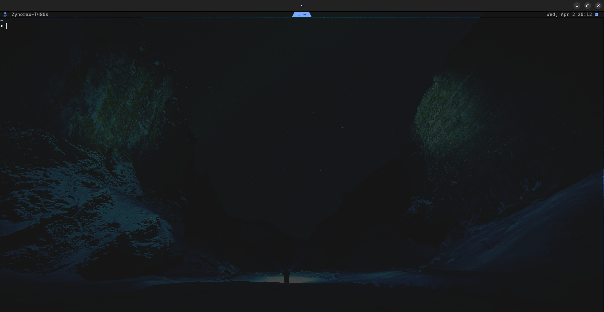
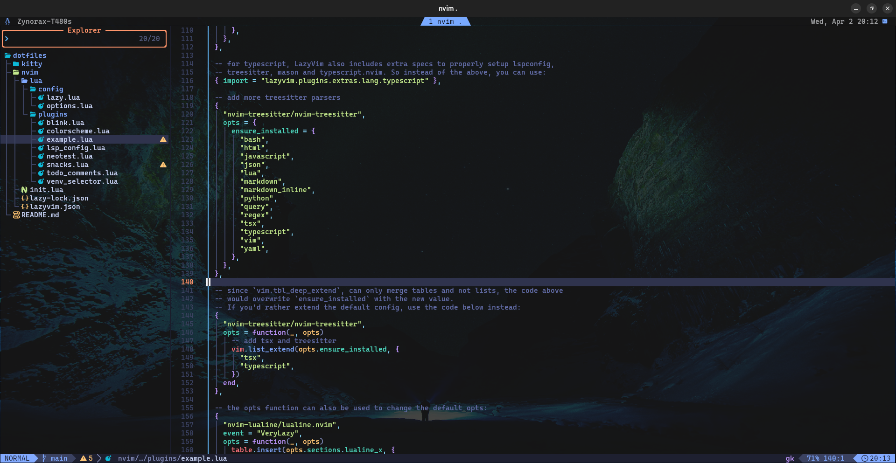
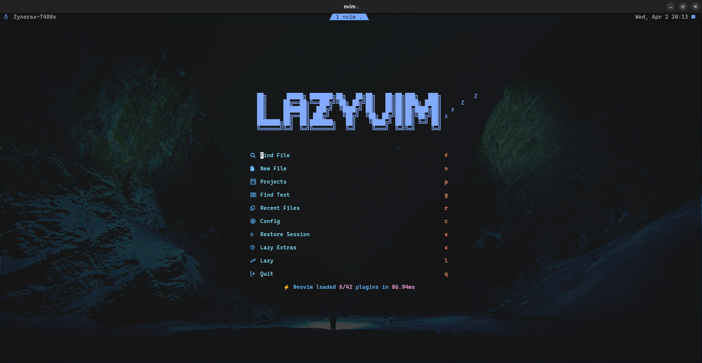

# 🖥️ Kitty & Neovim (LazyVim) Dotfiles

This repository contains my customized configuration files for the Kitty terminal and Neovim (LazyVim). These dotfiles help enhance the terminal and coding experience with optimized themes, plugins, and key mappings.

## 📸 Screenshots

### Kitty Terminal



### Neovim (LazyVim)




## 🛠️ Installation

To set up these configurations on your system, follow these steps:

### 1️⃣ Clone the Repository

```sh
git clone https://github.com/your-username/your-repo.git ~/.dotfiles
```

### 3️⃣ Restart the Terminal and Neovim

Once symlinks are created, restart your terminal and Neovim to load the configurations.

## 🔧 Features

### Kitty Terminal

- Custom color scheme
- Optimized fonts and appearance
- Fast rendering with GPU acceleration

### Neovim (LazyVim)

- Preconfigured LazyVim setup
- Custom key mappings for efficient coding
- Plugins for LSP, Git, and productivity

## 🤝 Contributing

Feel free to fork this repository, submit issues, or open pull requests to improve these dotfiles.

---

⭐ If you find this useful, give it a star on GitHub! ⭐
